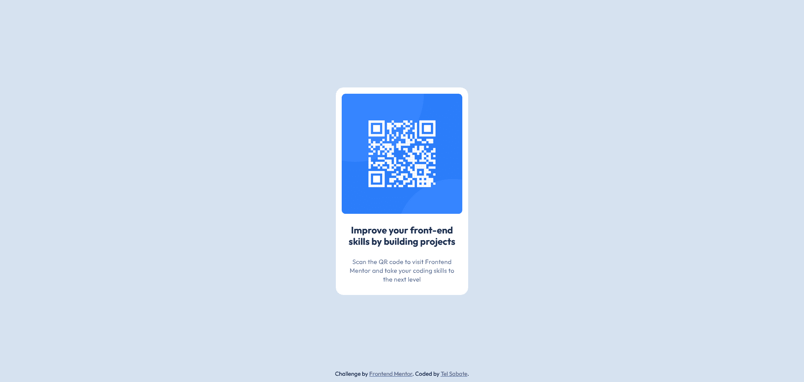

# Frontend Mentor - QR code component solution

This is a solution to the [QR code component challenge on Frontend Mentor](https://www.frontendmentor.io/challenges/qr-code-component-iux_sIO_H). Frontend Mentor challenges help you improve your coding skills by building realistic projects. 

## Table of contents

- [Overview](#overview)
  - [Screenshot](#screenshot)
  - [Links](#links)
- [My process](#my-process)
  - [Built with](#built-with)
  - [What I learned](#what-i-learned)
  - [Continued development](#continued-development)
  - [Useful resources](#useful-resources)
- [Author](#author)

**Note: Delete this note and update the table of contents based on what sections you keep.**

## Overview

### Screenshot



### Links

- Solution URL: [QR Code Component Project Solution](https://github.com/telsabate-hub/qr-code-component-project)
- Live Site URL: [QR Code Component Project](https://telsabate-hub.github.io/qr-code-component-project/)

## My process

### Built with

- Semantic HTML5 markup
- CSS custom properties
- Flexbox

### What I learned

The CSS below helped me center the component vertically on the screen.

```css
display: flex
flex-direction: column;
justify-content: center;
height: 100vh;
```

### Continued development

I need to learn more on semantic HTML and responsive CSS design.

### Useful resources

- [web.dev](https://web.dev) - This site helped me remember the concepts I needed for HTML and CSS.

## Author

- Website - [Tel Sabate](https://www.your-site.com)
- Frontend Mentor - [@telsabate-hub](https://www.frontendmentor.io/profile/telsabate-hub)


